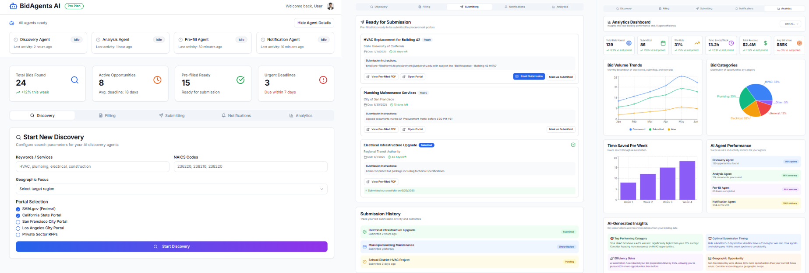
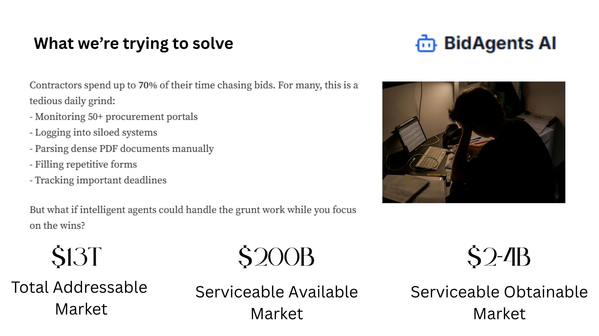
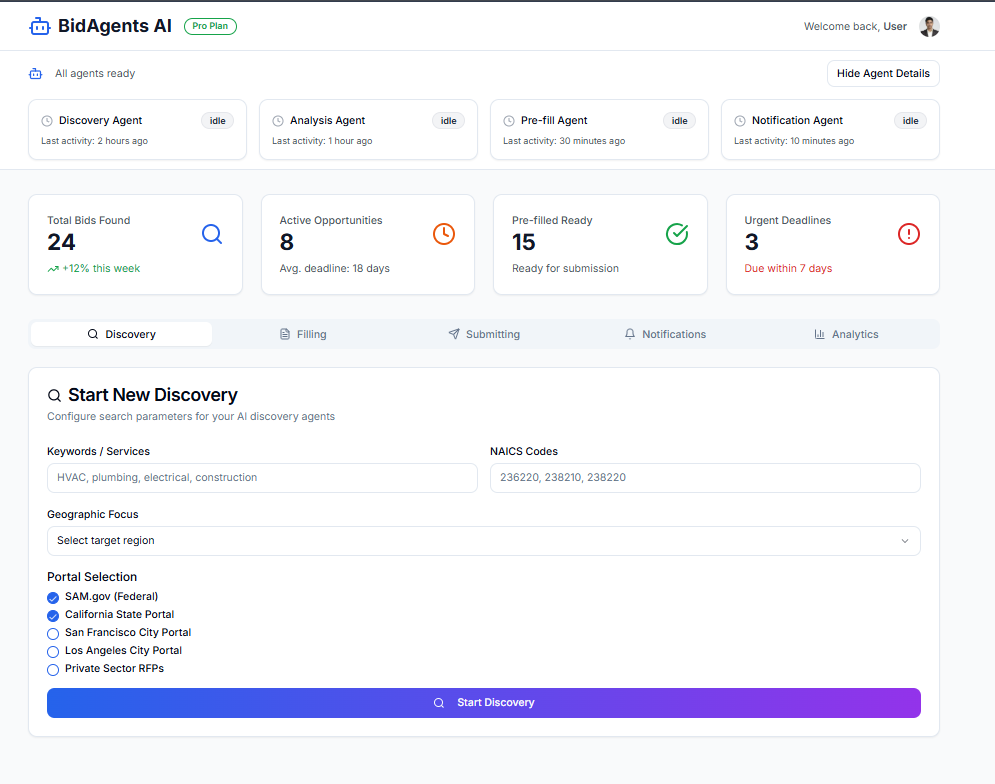
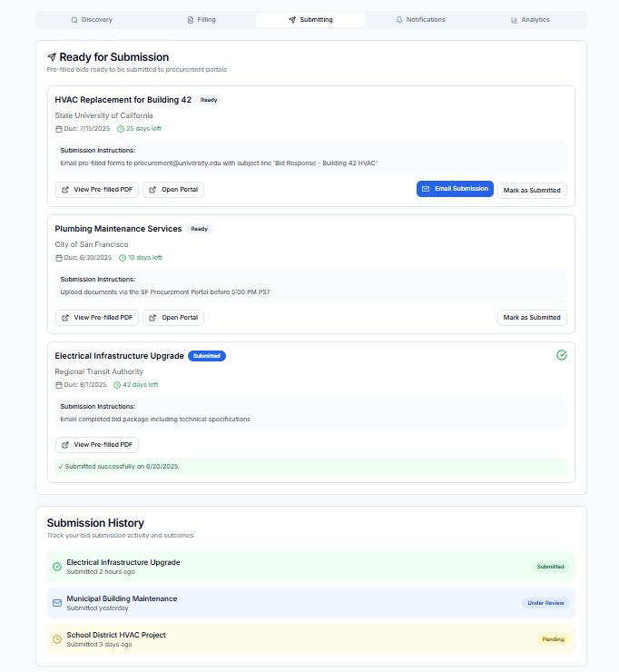
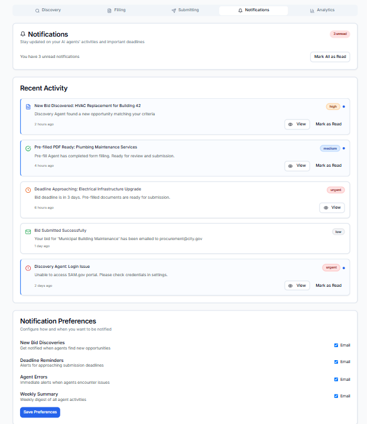
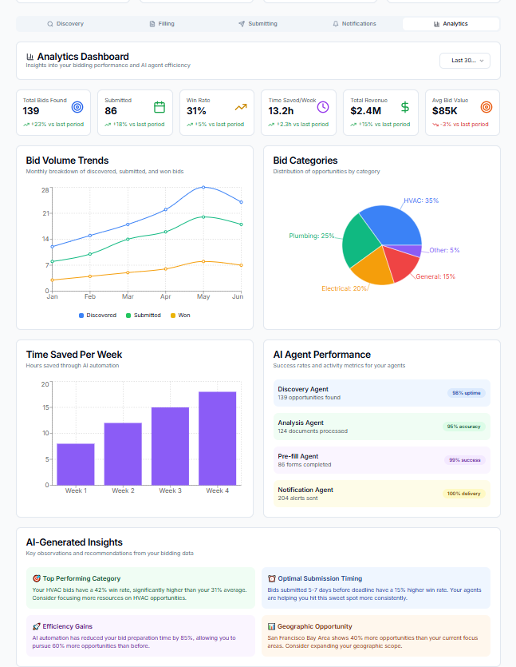
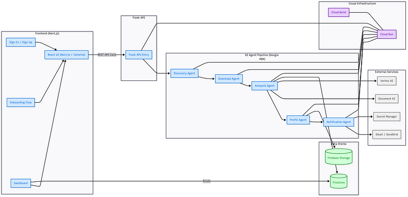
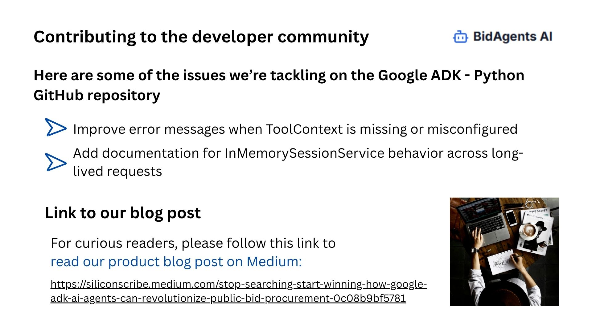
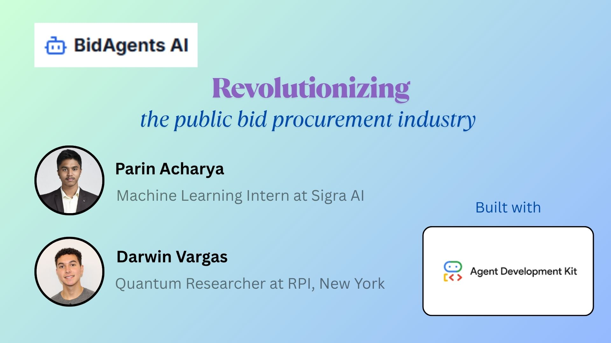

# BidAgents AI: Stop Searching, Start Winning.
Frees up valuable time for small and mid-sized contractors through a multi-agent approach for searching, filling, and submitting public bid proposals - letting them focus on the wins!


<p align="center">
    
</p>
---
## 🧠 Inspiration  
> “Having worked alongside a general contractor, I’ve seen just how time-consuming and fragmented the bidding process can be. Orchestrating AI agents to handle the grunt work could free up valuable time for contractors.”  
> — *Darwin Vargas, Co-Founder*

_So we've built a revolutionary platform to **transform the industry forever**._

## 🛠️ The PROBLEM: PUBLIC BID PROCUREMENT IS BROKEN

<p align="center">
    
</p>
_Contractors spend up to 70% of their time chasing bids. For many, this is a tedious daily grind:_  
- Monitoring 50+ procurement portals  
- Logging into siloed systems  
- Parsing dense PDF documents manually  
- Filling repetitive forms  
- Tracking important deadlines 

But what if intelligent agents could handle the grunt work while **you focus on the wins**?  

## 🚀 Introducing BidAgents AI  
Leveraging Google’s recently released Agent Development Kit (ADK), Vertex AI and Google Cloud, BidAgents AI orchestrates a **supervised team of intelligent web-scraping and browser-automation agents in an end-to-end pipeline for public bid procurement**. All with minimal human intervention.

---
## 💎 Unique Value Proposition  - What differentiates us from the crowd
| **Feature**                             | **Description**                                                                                                                        |
|-----------------------------------------|----------------------------------------------------------------------------------------------------------------------------------------|
| **Continuous Bid Discovery** 🔍         | Monitors 50+ procurement portals autonomously and discovers new opportunities in real time.                                             |
| **Automated Document Access** 📥        | Logs in, downloads PDFs/Word/ZIPs, and invokes Document AI to convert them into machine-readable formats.                               |
| **Precision Analysis Agent** 🧠         | Uses Google Document AI + Vertex AI Embeddings to extract deadlines, requirements, and evaluation criteria with high accuracy.          |
| **End-to-End Form Pre-fill & Submission** 📝 | Auto-fills forms with company data and manages submissions (uploads, emails, e-filing) seamlessly.                                      |
| **Real-Time Notifications** 🔔         | Sends process summaries and deadline alerts via Gmail/SendGrid, keeping contractors informed at every stage.                           |
| **Analytics & Insights Dashboard** 📊    | Visualizes bid pipeline performance, win-rate suggestions, and efficiency gains using BigQuery and custom dashboards.                   |

## 🌍 Market Competitor Analysis
Compared to leading competitors, BidAgents AI stands out with its **holistic agent-based approach** and **real-time automation**:

| **Feature / Company**                                | **BidAgentsAI** | **AI Tenders** | **Brainial** | **Altura** | **Xait** | **Mytender.io** | **IBM Watson Supply Chain** | **SAP Ariba** |
|------------------------------------------------------|-----------------|----------------|--------------|------------|---------|------------------|------------------------------|---------------|
| **End-to-end bid process orchestration**             | ✓               | ✗              | ✗            | ✗          | ✗       | ✗                | ✓                            | ✓             |
| **Real-time bid discovery & monitoring**             | ✓               | ✗              | ✗            | ✗          | ✗       | ✗                | ✗                            | ✗             |
| **Automated document parsing & form fill**           | ✓               | ✗              | ✗            | Partial    | Partial | Partial          | ✓                            | ✓             |
| **Multi-agent AI architecture**                      | ✓               | ✗              | ✗            | ✗          | ✗       | ✗                | ✗                            | ✗             |
| **Focus on mid-sized contractors**                   | ✓               | ✓              | ✓            | ✓          | ✓       | ✓                | ✗                            | ✗             |
| **Advanced analytics & performance insights**        | ✓               | Limited        | Limited      | Limited    | Limited | Limited          | ✓                            | ✓             |
| **Cloud-native & scalable architecture**             | ✓               | ✓              | ✓            | ✓          | ✓       | ✓                | ✓                            | ✓             |
| **Integration with multiple procurement portals**    | ✓               | Limited        | Limited      | Limited    | Limited | Limited          | ✓                            | ✓             |

> *Sources: Competitor websites and industry reports*

---

## 📈 Market Value Analysis  

- **TAM (Global Public Procurement)**: \$13 trillion (12% of global GDP)  
- **SAM (NA & EU Digital Procurement)**: \$200 billion  
- **SOM (Mid-market Contractors)**: \$2–4 billion (1–2%)

---

## 🤖 Why We Chose Google Agent Development Kit (ADK)

ADK’s open-source Python framework gives us:  
- **Modularity & Precise Tool Control for Agents**  
- **Seamless Agent Deployment** across Google Cloud using Cloud Run containers
- **Extensibility** to add new agents or integrate services

---

## 🧙‍♂️ Where the Magic Lies — Meet the team of AI Agents  

### 🕵️ Discovery Agent  
Continuously and autonomously scrapes procurement portals (SAM.gov, state & city sites) to find new bid opportunities.

<p align="center">
    
</p>

### 📂 Document Access Agent  
Automates downloading of PDFs, Word files, or ZIPs, then uses Document AI to convert them into machine-readable formats.  
- **Downloader Subagent**: Manages sessions & retrieval  
- **Preprocessing Subagent**: Formats files for analysis  

### 🔎 Analysis Agent  
Leverages Google Document AI to extract deadlines, submission requirements, evaluation criteria, and more.  
- **Field Extraction Subagent**: Identifies specific fields  
- **Validation Subagent**: Ensures accuracy & completeness  

### 📝 Pre-fill & Submit Agent  
<p align="center">
    
</p>
Auto-fills all required form fields with company data (certifications, past performance, contact details), then handles submission workflows (uploads, emails, e-filing).

### 🔔 Notification Agent  
<p align="center">
    
</p>
Sends timely alerts and process summaries via Gmail/SendGrid.

### 📊 Analytics Agent  
<p align="center">
    
</p>
Reads Firestore to power dashboards and performance insights for data-driven decision making.

---

## 🏗️ System Design Architecture & Tech Stack  
<p align="center">
    
</p>
*This sophisticated orchestration is powered by a robust Google Cloud ecosystem.*

- **Agents & Orchestration**: Google ADK, Cloud Run, Cloud Functions  
- **AI & NLP**: Vertex AI Embeddings, Document AI  
- **Data Stores**: Firestore (metadata), Firebase Storage (documents)  
- **Notifications**: Gmail API / SendGrid  
- **Security**: Secret Manager, IAM, encryption at rest & in transit  

---

## 🎯 Expected Product Outcomes  
- **50%** reduction in manual bid processing time  
- **30%** increase in bid win rate  
- **24/7** opportunity monitoring — never miss a deadline  
- **ROI payback** in under 3 months for mid-sized contractors

---

## 🧩 Challenges We Faced  
- **Diverse Document Formats**: Built robust retry logic and prompt engineering for the Discovery Agent (browser agent) to handle unstructured information from public procurement portals.  
- **Secure Credential Management**: Integrated Cloud Secret Manager and fine-grained IAM rules.
---

## 🏆 Accomplishments We’re Proud Of  
- **70%+** form-fill accuracy using custom-engineered prompts & Document AI logic  
- **30-second** processing and notification of new bids post-publication
- Gemini Computer Vision to solve CAPTCHA and web blockers
- Seamless **zero-downtime** updates via Cloud Build & Cloud Run

---
## 🔮 Future Improvements  
- **NLP-Driven Recommendations** for bid suitability  
- **International Portal Coverage** (EU, UK, Australia)  
- **Offer 3 month pilot programs with local small to mid-sized contractors with dynamic revenue models**
- Gather user feedback for the current prototype

---

## 🤝 Contributing to the Developer Community  
<p align="center">
    
</p>
We’re actively improving the Google ADK Python SDK:  
- Added a technical issue on GitHub for **`InMemorySessionService` behavior** documentation [#Issue 1569](https://github.com/google/adk-python/issues/1569)
- Published a [project blog post on Medium](https://siliconscribe.medium.com/stop-searching-start-winning-how-google-adk-ai-agents-can-revolutionize-public-bid-procurement-0c08b9bf5781)

---

## ✨ Final Remarks  
In this AI-era, BidAgents AI exemplifies how intelligent multi-agent workflows can transform bid procurement—letting contractors focus on winning, not chasing.

---

## 🙋 Frequently Asked Questions  

**Q: How secure is my data?**  
A: End-to-end encryption, IAM controls, ISO 27001 & SOC 2 compliant.

**Q: Can agents handle non-PDF formats?**  
A: Yes — supports Word, Excel, HTML/XML via preprocessing subagents.

**Q: Do you offer SLA-backed support?**  
A: Absolutely — 24/7 support with guaranteed response times for enterprise clients.  

---
## Try BidAgents AI today 

Feel free to leave feedback in the comments, or reach out directly on [LinkedIn](https://www.linkedin.com/in/parin-acharya-5b787b35b/).

**Demo**: [YouTube](https://www.youtube.com/watch?v=edOBWC918lw)

**Presentation**: [Slide Deck](https://drive.google.com/file/d/1a2MSqw_TPgVQdNpe2dNWRrXXTijdU5Q3/view?usp=sharing)

<p align="center">
    
</p>


## 🚀 Getting Started

### Prerequisites
- Node.js 18+ and npm
- Python 3.9+
- Google Cloud Project with enabled APIs
- Firebase project

### Environment Variables

Create `.env.local` in the frontend:
```env
NEXT_PUBLIC_FIREBASE_API_KEY=your_api_key
NEXT_PUBLIC_FIREBASE_PROJECT_ID=your_project_id
NEXT_PUBLIC_FIREBASE_STORAGE_BUCKET=your_bucket
NEXT_PUBLIC_FIREBASE_MESSAGING_SENDER_ID=your_sender_id
NEXT_PUBLIC_FIREBASE_APP_ID=your_app_id
```

Create `.env` in the backend:
```env
GOOGLE_APPLICATION_CREDENTIALS=/path/to/service-account.json
FIREBASE_PROJECT_ID=your_project_id
FIREBASE_STORAGE_BUCKET=your_bucket

```

### Installation

1. **Frontend Setup**
```bash
npm install
npm run dev
```

2. **Backend Setup**
```bash
cd backend
pip install -r requirements.txt
python app.py
```
